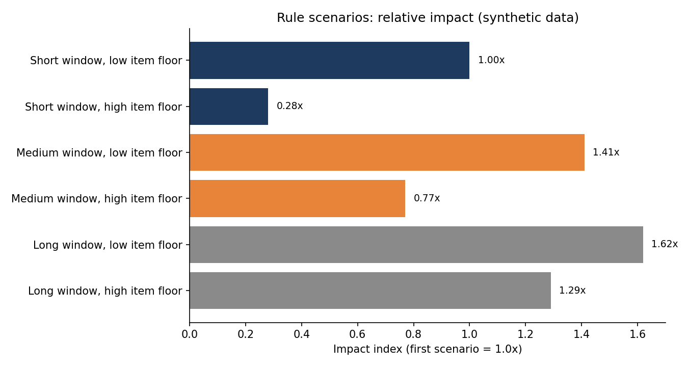

# Repeat Customer Cancellation Risk Framework

A small, repeat-offender segment of buyers and devices can drive a disproportionate share of customer cancellations in e-commerce, and every cancelled item reduces net order conversion. This project shows a generic way to size a buyer and device level rule for that behaviour before it goes live.

> **Everything here is synthetic.** Data, parameter values and results are illustrative placeholders. They do not represent any real platform, threshold, business rule or result.

## Problem

- Customer cancellations are a major leak between gross and net orders.
- The damage is concentrated: a few buyers, often using a few devices, cancel almost everything they order.
- Platform-wide averages hide this, so blanket controls would hurt genuine customers.

## Approach

1. **Define the signal.** Cancellation rate and cancelled item count for a buyer (and the device they use) over a look-back window.
2. **Build scenarios.** A grid of rules combining a look-back window length and a minimum cancelled-item floor.
3. **Replay history.** Flag a buyer the day the rule would first trigger, apply a one-day data refresh lag, and count cancelled items that would have been prevented afterwards.
4. **Check precision.** Compare flagged buyers with seeded abusers and a heavy-but-legitimate segment to expose false positives.
5. **Roll out in phases.** Start with the lowest-risk settings, observe, then extend only after peak-campaign data is in view.

## Illustrative results (synthetic, relative figures only)

| Scenario | Flagged buyers index | Precision | Impact index |
|---|---|---|---|
| Short window, low item floor | 1.00x | 0.77 | 1.00x |
| Short window, high item floor | 0.24x | 0.83 | 0.28x |
| Medium window, low item floor | 1.53x | 0.74 | 1.41x |
| Medium window, high item floor | 0.63x | 0.81 | 0.77x |
| Long window, low item floor | 1.84x | 0.73 | 1.62x |
| Long window, high item floor | 1.23x | 0.76 | 1.29x |

Indices are relative to the first scenario (1.0x).



Takeaways:

- Longer windows catch more but precision drops, since a long look-back is more exposed to campaign-driven cancellation spikes.
- Higher item floors are safer but leave most of the impact on the table.
- A single global rule is the wrong tool. Market and window specific settings work better.

## Repository layout

```
sql/        Generic SQL templates with placeholder parameters
src/        Python simulation that replays the scenarios on synthetic data
data/       Scenario results on synthetic data, relative figures only (CSV)
images/     Charts
```

## Run it

```bash
pip install -r requirements.txt
python src/simulate_rule_impact.py
```

## Notes

- Cancellation rate is distinct cancelled items over distinct total items.
- Item ids can collide across markets, so multi-market counts need a composite key.
- Table names, field names and parameter values are generic placeholders.
- A buyer-level rule alone can be sidestepped by splitting activity across accounts, so pair it with device-level logic.

## Author

K M Kadir Koushik, Daraz Bangladesh (Alibaba Group)
